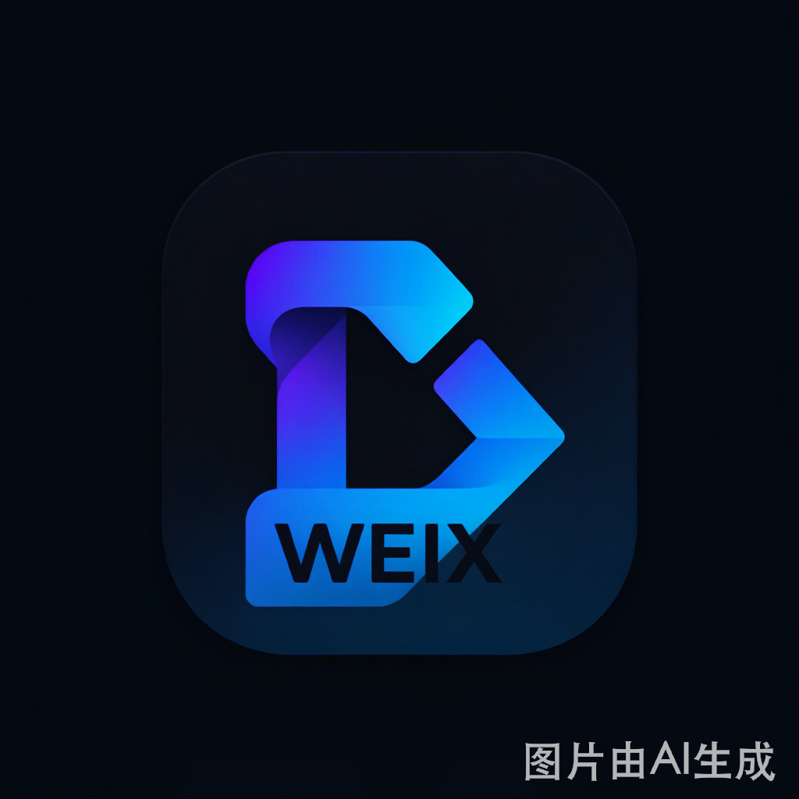

<p align="center">
  
</p>

<h1 align="center">WEIX</h1>

<p align="center">
  <strong>从 GitHub Trending 到全平台发布，一句话搞定。</strong>
</p>

<p align="center">
  
  
  
  
</p>

---

## 一句话就够了

> "帮我把本周最火的开源项目写成文章发出去"

剩下的，**WEIX 全自动搞定**：

```
🔥 抓取 GitHub 本周最热项目
🗄️ 资源自动存入百度网盘 + 夸克网盘，生成分享链接
✍️  AI 撰写 3000-5000 字深度分析
📱 一键推送到微信公众号草稿箱
🌐 自动同步到你的个人网站（GitHub + Cloudflare Pages）
🐦 衍生 Twitter / LinkedIn / Newsletter 多版本
```

**从「发现热点」到「全平台发布」，6 步变 1 步。**

---

## 为什么叫 WEIX

**WE**（我们）+ **IX**（罗马数字 9，极致的象征）

我们帮你把内容做到极致 — **WE do it, IX times better.**

---

## 为什么你需要它

| 没有 WEIX | 有了 WEIX |
|---|---|
| 手动翻 GitHub Trending | 一条命令自动抓取 |
| 下载源码、打包、手动上传网盘 | 自动上传双网盘 + 生成链接 |
| 憋 3 小时写不出文章 | AI 10 分钟生成初稿 |
| 复制粘贴发微信还要排版 | 一次推送进草稿箱 |
| 每个平台重新写一遍 | 一键衍生多平台版本 |

**让内容创作者回归创作，让重复劳动交给管道。**

---

## 管道架构

```
                     ┌───────────────────────────┐
                     │    GitHub Trending API     │
                     │  本周 / 今日 / 本月最火     │
                     └─────────────┬─────────────┘
                                   │ trending.json
                                   ▼
          ┌────────────────────────┴────────────────────────┐
          │                                                 │
          ▼                                                 ▼
┌──────────────────┐                              ┌──────────────────┐
│   百度网盘       │                              │   夸克网盘        │
│   bdpan upload   │                              │   quark upload   │
│   bdpan share    │                              │   quark share    │
└────────┬─────────┘                              └────────┬─────────┘
         │    分享链接                                    │    分享链接
         └──────────────────┬─────────────────────────────┘
                            │ share_links.json
                            ▼
                   ┌─────────────────┐
                   │   AI 文章生成    │
                   │   刘润风格       │
                   │   3000-5000 字   │
                   └────────┬────────┘
                            │ article.md
                            ▼
     ┌──────────────────────┼──────────────────────┐
     │                      │                      │
     ▼                      ▼                      ▼
┌──────────┐     ┌─────────────────┐     ┌──────────────────┐
│ 微信公众号│     │  个人网站        │     │   多平台分发       │
│ 草稿箱   │     │  GitHub + CF    │     │   Twitter         │
│          │     │  Pages 部署     │     │   LinkedIn        │
│          │     │  xyjunjunni.    │     │   Newsletter      │
│          │     │  space          │     │                   │
└──────────┘     └─────────────────┘     └──────────────────┘
```

---

## 快速开始

```bash
# 1. 克隆
git clone https://github.com/xinyuzjj/WEIX.git
cd WEIX

# 2. 配置
cp config.example.json config.json
# 编辑 config.json，填入你的密钥

# 3. 跑！
python3 scripts/pipeline.py --period weekly --limit 3
```

30 秒后，你会在 `output/` 目录下看到：

```
output/2026-06-27/
├── trending.json        ← 热门项目数据
├── share_links.json     ← 网盘分享链接
├── article.md           ← AI 生成文章
└── report.json          ← 完整执行报告
```

---

## 安装到你的 AI Agent

### Hermes Agent
```bash
git clone https://github.com/xinyuzjj/WEIX.git ~/.hermes/skills/weix
```

### OpenClaw
```bash
git clone https://github.com/xinyuzjj/WEIX.git ~/.agents/skills/weix
```

### WorkBuddy
```bash
git clone https://github.com/xinyuzjj/WEIX.git ~/.workbuddy/skills/weix
```

安装后直接对 Agent 说：**"跑一下 WEIX，抓本周热门"** 即可。

---

## 六个模块，各司其职

| 脚本 | 功能 | 可独立运行 |
|------|------|:----:|
| `scripts/trending.py` | GitHub Trending 抓取 | ✅ |
| `scripts/drives.py` | 百度网盘 + 夸克网盘上传分享 | ✅ |
| `scripts/writer.py` | AI 深度文章生成 | ✅ |
| `scripts/wechat_pub.py` | 微信公众号草稿发布 | ✅ |
| `scripts/site_sync.py` | GitHub Pages 网站同步 | ✅ |
| `scripts/distribute.py` | Twitter / LinkedIn / Newsletter 分发 | ✅ |
| `scripts/pipeline.py` | 编排器，串联全部流程 | — |

每个模块都能**单独调用**，不需要完整管道也能用。

---

## 前置条件

| 依赖 | 用途 | 必须 |
|------|------|:----:|
| Python 3.11+ | 运行环境 | ✅ |
| `bdpan` CLI | 百度网盘操作 | ✅ |
| `gh` CLI | GitHub API / Git | ✅ |
| 夸克网盘 Cookie | 夸克网盘操作 | ✅ |
| 微信 APPID / SECRET | 发布到公众号 | ❌ |

---

## 贡献

欢迎 PR。大改动请先开 Issue 讨论。

---

## 许可证

MIT © [@xinyuzjj](https://github.com/xinyuzjj)

---

<p align="center">
  <sub>WE do it, IX times better.</sub>
</p>
